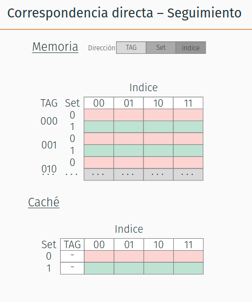
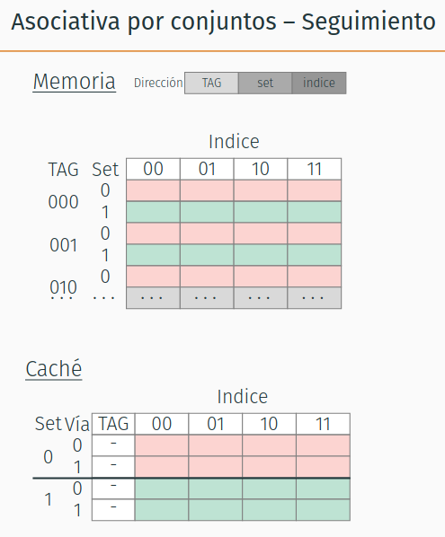
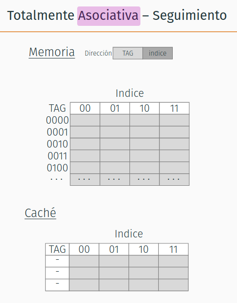

# Memoria Cache
Hacer el seguimiento de escrituras y lecturas de la siguiente secuencia de direcciones, en una memoria cache con las siguientes características:

- dirección de 7 bits y memoria direccionable a byte.
- 2 sets
- 4 líneas por set
- 8 bytes por bloque
- 1 byte por lectura/escritura

Suponga que la memoria cache está vacía al inicio y utiliza como política write-back / write-allocate. La política de desalojo es LRU.

| op | address | t | s | b | hit/miss/dirty-miss |
|:--:| :------ |:-:|:-:|:-:| :------------------ |
| W  | 0x15    |   |   |   |                     |
| W  | 0x63    |   |   |   |                     |
| R  | 0x2E    |   |   |   |                     |
| R  | 0x58    |   |   |   |                     |
| R  | 0x10    |   |   |   |                     |
| W  | 0x0F    |   |   |   |                     |
| R  | 0x7F    |   |   |   |                     |
| W  | 0x2A    |   |   |   |                     |
| R  | 0x6F    |   |   |   |                     |
| R  | 0x1B    |   |   |   |                     |
| R  | 0x65    |   |   |   |                     |
| R  | 0x29    |   |   |   |                     |

¿Cambiaría algo si la política de desalojo fuera FIFO?

# Resolución
## Repaso terminología
Las direcciones están compuetas de: TAG + Indicador set (si hay sets) + índice bloque (offset)

La caché es una serie de SETs.
Un SET tiene `N` LÍNEAS. Cada línea está compuesta de:
- 1 bit de V alidez
- 1 opcional bit D irty
- TAG: su tamaño está dado por `# bits dirección` - `#bits set` - `#bits necesarios para direccionar bloque (offset)`
- BLOQUE (datos): su tamaño está dado por descripción de la caché

Que ocurre cuando tenemos colisiones en caché? Hay que desalojar algún dato. Las combinaciones típicas de políticas son:
- **write-through / no-write-allocate:** NO hay bit dirty, porque los cambios en memoria se reflejan directo en disco.
- **write-back / write-allocate:** hay bit dirty, porque los cambios en memoria se reflejan en disco recién al desalojar.

### Cache mapeo directo/Correspondencia directa

### Cache asociativa por conjuntos / E vías

### Cache totalmente asociativa


## Ejercicio
La cache tiene más de un set, así que no es full asociativa (mostrar dibujo diapo full asociativa)
Además tiene más de una línea (vía) por set, así que no puede ser correspondencia directa
=> **es asociativa por conjuntos**, con 2 sets y 4 vías

desconpongamos una dirección para identificar los tamaños de cada componente de la línea
- direcciones de 7 bits: tomemos la dir 0x15
```txt
  1       5
-----  -------
0 0 1  0 1 0 1
```

- bloque tiene 8 bytes y direcciono a byte => necesito 3 bits para offset bloque
- hay dos sets => necesito 1 bit para direccionar set
- el resto es tag
Por lo que la direcció queda descompuesta:
```txt
  t   s   b
----- - -----
0 0 1 0 1 0 1
```

#### Memoria
Por lo tanto, la memoria queda subdividida del siguiente modo:

| TAG | Set | índice |  |  |  |  |  |  | 
| --- | --- | ------ |--|--|--|--|--|--| 
|     |     | 000 | 001 | 010 | 011 | 100 | 101 | 110 | 111 |
| 000 | 0 | 0 | 1 | 2 | 3 | 4 | 5 | 6 | 7 |
|     | 1 | 8 | 9 | 10 | 11 | 12 | 13 | 14 | 15 |
| 001 | 0 | 16 | 17 | 18 | 19 | 20 | 21 | 22 | 23 |
|     | 1 | 24 | 25 | 26 | 27 | 28 | 29 | 30 | 31 |
| 010 | 0 | 32 | 33 | 34 | 35 | 36 | 37 | 38 | 39 |
|     | 1 | 40 | 41 | 42 | 43 | 44 | 45 | 46 | 47 |
| 011 | 0 | 48 | 49 | 50 | 51 | 52 | 53 | 54 | 55 |
|     | 1 | 56 | 57 | 58 | 59 | 60 | 61 | 62 | 63 |
| 100 | 0 | 64 | 65 | 66 | 67 | 68 | 69 | 70 | 71 |
|     | 1 | 72 | 73 | 74 | 75 | 76 | 77 | 78 | 79 |
| 101 | 0 | 80 | 81 | 82 | 83 | 84 | 85 | 86 | 87 |
|     | 1 | 88 | 89 | 90 | 91 | 92 | 93 | 94 | 95 |
| 110 | 0 | 96 | 97 | 98 | 99 | 100 | 101 | 102 | 103 |
|     | 1 | 104 | 105 | 106 | 107 | 108 | 109 | 110 | 111 |
| 111 | 0 | 112 | 113 | 114 | 115 | 116 | 117 | 118 | 119 |
|     | 1 | 120 | 121 | 122 | 123 | 124 | 125 | 126 | 127 |

### Completemos las tablas
#### Acciones
| op | address | t(3) | s(1) | b(3) | hit/miss/dirty-miss |
|:--:| :------ |:----:|:----:|:----:| :------------------ |
| W  | 0x15    | 001  |  0   | 101  |        miss         |
| W  | 0x63    | 110  |  0   | 011  |        miss         |
| R  | 0x2E    | 010  |  1   | 110  |        miss         |
| R  | 0x58    | 101  |  1   | 000  |        miss         |
| R  | 0x10    | 001  |  0   | 000  |        hit          |
| W  | 0x0F    | 000  |  1   | 111  |        miss         |
| R  | 0x7F    | 111  |  1   | 111  |        miss         |
| W  | 0x2A    | 010  |  1   | 010  |        hit          |
| R  | 0x6F    | 110  |  1   | 111  |        miss         |
| R  | 0x1B    | 001  |  1   | 011  |     dirty miss      |
| R  | 0x65    | 110  |  0   | 101  |        hit          |
| R  | 0x29    | 010  |  1   | 001  |        hit          |

#### Cache
##### Si la cache es LRU
| Set | Vía | v | d | tag | bloque |
|-----|-----|---|---|-----|--------|
|  0  |  0  | 1 | 1 | 001 | 16-23   |
|     |  1  | 1 | 1 | 110 | 96-103 |
|     |  2  | 1 |   |     |        |
|     |  3  | 1 |   |     |        |
|  1  |  0  | 1 | 1 (cambia al escribir 0x2A) | 010 | 40-47  |
|(se desaloja al leer 0x6F)|  1  | 1 | 0 | 101 | 88-95  |
|(leo 0x6F)|  1  | 1 | 0 | 110 | 104-111  |
|(se desaloja al leer 0x10)|  2  | 1 | 1 | 000 | 8-15 |
|(leo 0x1B)|  2  | 1 | 0 | 001 | 24-31 |
|     |  3  | 1 | 0 | 111 | 120-127 |

##### Si la cache es FIFO
| Set | Vía | v | d | tag | bloque |
|-----|-----|---|---|-----|--------|
|  0  |  0  | 1 | 1 | 001 | 16-23  |
|     |  1  | 1 | 1 | 110 | 96-103 |
|     |  2  | 1 |   |     |        |
|     |  3  | 1 |   |     |        |
|  1  (se desaloja al leer 0x6F, dm)|  0  | 1 | 1 (cambia al escribir 0x2A) | 010 | 40-47  |
|     |  0  | 1 | 0 | 110 | 104-111  |
|(se desaloja al leer 0x1B)|  1  | 1 | 0 | 101 | 88-95 |
|     |  1  | 1 | 0 | 001 | 24-31 |
|(se desaloja al leer 0x29, DIFF A LRU)|  2  | 1 | 1 | 000 | 8-15 |
|     |  2  | 1 | 0 | 010 | 40-47 |
|     |  3  | 1 | 0 | 111 | 120-127 |